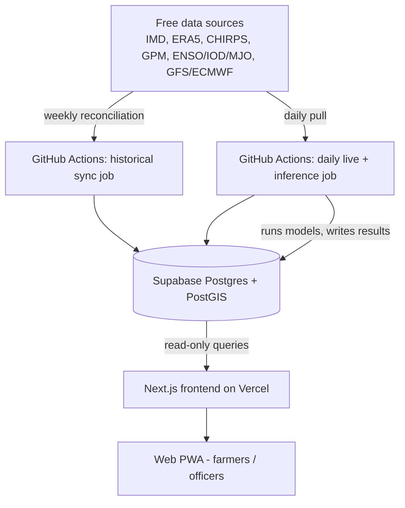

# BHUMI — Technical Architecture & Stack

Companion to `PRD.md`. This document is the **single authoritative technical-stack reference** for the BHUMI project. It reflects the actual deployed repository (Steps 1–6 accepted, root-level Next.js app) and reconciles both prior drafts into one canonical document.

Last reconciled: 2026-09-28 (Steps 1–6 accepted; UI Phase underway per `docs/ANTIGRAVITY_UI_PROMPT.md`).

---

## 1. Architecture overview

The single most important decision in this whole stack: **nothing expensive ever runs in the request path.** All ingestion, downscaling, and model inference happen on a schedule, in the background, and the frontend only ever reads a small precomputed table. That's what makes "high accuracy" and "instant response" compatible on a free tier — they're solved by different parts of the system, not by making one clever fast model.



> **Note:** WhatsApp pull-bot is listed in the PRD as a future Phase 2 channel and is **not implemented** in Steps 1–6. It has been removed from the active architecture diagram above.

**Why GitHub Actions instead of Vercel Cron?** Vercel Hobby cron jobs are capped to once a day, function execution time is short, and the deployment size for serverless functions is limited — a poor fit for Python geospatial/ML dependencies (xarray, rasterio, lightgbm, netCDF4). GitHub Actions on a **public** repo gives effectively unlimited free minutes, no meaningful execution-time ceiling, and a normal Linux VM where any Python stack installs cleanly. So: **Vercel serves, GitHub Actions computes.**

---

## 2. Database: Supabase Postgres + PostGIS

| | Supabase (Postgres + PostGIS) | MongoDB Atlas (M0 free) |
|---|---|---|
| Free storage cap | 500 MB | 512 MB — similar, not a differentiator |
| Spatial joins (point-in-polygon for panchayat→block, nearest-block lookups) | Native, mature (PostGIS `ST_Contains`, `ST_Distance`, spatial indexes) | Geospatial indexes exist but are built for point/radius queries, not polygon-heavy admin-boundary joins |
| Fit for the data shape | Data here is fundamentally relational: fixed admin units (block/panchayat), each with a time series of numeric variables and a foreign key to terrain features. That's exactly what a relational schema is for. | Document model adds no benefit here — you'd end up modelling it relationally inside JSON anyway |
| Native array types | `smallint[]` — used directly in the storage design below | Arrays exist as BSON arrays but don't compress the "row-per-day" problem the same way |
| Bundled free extras | Auth, Storage, Edge Functions, Realtime, auto-generated REST API — one account covers the whole backend | Would need a separate free-tier auth/hosting layer |

**Decision: Supabase Postgres + PostGIS.** MongoDB isn't a bad database in general, it's just solving problems this project doesn't have.

One operational note: Supabase free projects **auto-pause after 7 days of inactivity**. The daily ingestion job in §4 writes to the DB every single day, so this never triggers as long as that job is running — worth knowing so nobody "fixes" the pipeline by making it less frequent.

---

## 3. Storage design — how 500 MB covers all of India

**The trap to avoid:** storing one row per block per day. At ~6,700 blocks, a naive daily table blows the budget almost immediately — Postgres per-row overhead (tuple header + index entries) dominates once you're inserting millions of narrow rows, regardless of how small the columns are. Rough math: 6,700 blocks × 365 days × ~80 bytes/row (with one index) ≈ **250 MB per year** — three years and you're out of room, nowhere near the 10–15 years of history a teleconnection-driven model needs.

**The fix: one row per block per *season*, with each variable stored as a compact array**, not one row per block per day.

- **Season window**: 1 Apr – 31 Oct (214 days) — covers pre-onset build-up through withdrawal. Off-season (Nov–Mar) isn't needed for this problem and is skipped in the archive; it's always re-derivable from the upstream free sources if ever needed later.
- **Variables per block-year** (4 arrays of `smallint[214]`, using scaled integers instead of floats to halve the width): rainfall (mm ×10), max temperature (°C ×10), a soil-moisture/wetness index, and a derived onset/active/break/normal state code.
- **Per block-year row size**: ~1.8 KB (4 arrays × ~450 bytes each, including Postgres array overhead).
- **Full India, one season**: 6,700 blocks × 1.8 KB ≈ **12 MB/year**.

| Component | Size |
|---|---|
| Block-level archive, 12 seasons (e.g. 2014–2025) | ~145 MB |
| Rolling 90-day live buffer (long format, small and short-lived so the overhead doesn't matter) | ~30 MB |
| Simplified block boundary polygons (PostGIS geometry, `ST_SimplifyPreserveTopology`, for map rendering + panchayat point-in-polygon) | ~20–25 MB |
| Static terrain features per block (elevation, slope, distance-to-coast, agro-climatic zone) | <1 MB |
| National ENSO/IOD/MJO index history, 40+ years (single national series, not per-block — negligible) | ~1 MB |
| Trained model artifacts (LightGBM, XGBoost, small analog/GRU params) | ~5–10 MB |
| **Total** | **~210–215 MB, leaving ~55% headroom** |

**Panchayat-level data is never stored.** ~250,000 panchayats vs ~6,700 blocks is a ~37× multiplier that would blow any budget. Panchayat values are computed on request: block value + a static terrain adjustment (elevation/slope-based downscaling, BCSD-style) using the terrain table above. This satisfies the PS's "panchayat scale" requirement as a computed output, not a stored history.

Recommended default: **12 years of block-level history (2014–2025)** — enough seasons for the downscaling model to have seen a real spread of ENSO/IOD phases, with comfortable room left for the live buffer, geometries, and inevitable schema iteration during the hackathon. It can be extended later without a redesign, since the source archives (ERA5, CHIRPS, IMD) keep the full record permanently — only the derived, compact form lives in the 500 MB budget.

---

## 4. Data sources & pull cadence

Two cadences, not many — simplicity is itself a reliability feature for a hackathon team.

| Source | What it gives | Free access | Native update | Pull cadence |
|---|---|---|---|---|
| IMD gridded rainfall/temp (0.25°/1°, via IMD Pune) | Ground-truth rainfall & temperature, 1901/1951–present | Free; historically a registration step for non-commercial/academic use — start this in week 1. Open packages (`imddata`, `imdR`) already wrap the direct `.grd` download endpoints | Periodic updates | Weekly |
| ERA5 / ERA5-Land (Copernicus CDS) | Reanalysis: temp, humidity, wind, soil moisture, 1940–present | Free, `cdsapi` with a personal API key | Near-real-time (`ERA5T`) with ~5-day lag, finalized ~3 months later | Weekly, + monthly reconciliation pass swapping in finalized values |
| CHIRPS (UCSB Climate Hazards Center) | Satellite+station rainfall, 0.05°, 1981–present | Free, direct download | Preliminary ~2–3 day lag, finalized after ~3 weeks | Weekly, + monthly reconciliation |
| NASA GPM IMERG | Satellite precipitation, 0.1°, half-hourly | Free, needs a NASA Earthdata login | Early run ~4 hr lag, final ~3.5 months later | Daily for live buffer, weekly reconciliation for archive |
| NOAA ONI (ENSO), BOM DMI (IOD), BOM RMM (MJO) | Global teleconnection index state | Free, public files, no key | Monthly / weekly / daily respectively | Daily check (cheap — it's a handful of numbers) |
| NOAA GFS/GEFS (via NOMADS), ECMWF Open Data | Live forecast fields for the daily inference input | Free | Every 6 hrs / twice daily | Daily pull for the live buffer |
| NASA SMAP soil moisture | Soil moisture, ~2–3 day lag | Free, Earthdata login | Daily-ish | Daily check |
| ISRO MOSDAC (INSAT-3D/3DR) | Optional extra satellite input | Free with registration | Frequent | Daily, optional |

**Weekly historical sync** (e.g. every Sunday, one GitHub Actions job): pulls whatever's newly finalized since last week across every source above, appends it into the block-year archive, and performs the monthly reconciliation pass (swapping preliminary CHIRPS/ERA5T/GPM values for their finalized versions once available) so small errors don't accumulate silently in training data.

**Daily live pull** (e.g. 6 AM IST, a separate lighter job): grabs only the latest GFS/ECMWF forecast fields and the latest index readings into the 90-day live buffer, then immediately runs inference (§5) and writes that day's block-level risk output to the table the frontend reads. This is also what keeps the Supabase project from auto-pausing.

**Retraining**: not daily, not weekly. Retrain offline against the accumulated archive once per season (pre-Kharif in May, pre-Rabi in October) using a rolling-origin time split (train on earlier years, validate on later ones — never shuffle time series data, or you leak future into past). The physical relationship between MJO phase and regional rainfall doesn't shift week to week, so more frequent retraining adds engineering risk for no real accuracy gain.

---

## 5. Model architecture — three stages, not one black box

All of this runs inside the daily GitHub Actions job, not on Vercel. Inference for all of India takes however long it takes (minutes), because it happens once a day in the background — the frontend never waits on it.

1. **Teleconnection state model** — turns the current ENSO/IOD/MJO state into a likely trajectory over the next 1–4 weeks. Given the actual dataset size here (a few dozen full ENSO/IOD cycles, not millions of examples), a heavy transformer is more likely to overfit than help. Use an **analog-ensemble** approach (find the historical years whose index state most closely matches today's, and treat their subsequent rainfall behavior as a probabilistic ensemble) as the primary method — this is genuinely what operational seasonal-forecast centers do, it's interpretable, and it's robust with limited data — with a small **GRU** as a secondary, nonlinear cross-check. The GRU is trained via supervised learning on historical teleconnection trajectories and forward targets (see Step 4 ML corrections).

2. **Downscaling model** — the workhorse. **LightGBM** as the primary classifier (fast, memory-efficient, and it scales to thousands of blocks × years of daily data better than XGBoost), with **XGBoost** run alongside as a second opinion; averaging the two is a lightweight 2-model ensemble that reduces variance without real added cost. Inputs are tabular: index state/trajectory, terrain features, local climatology, lag features. Output is classification (onset / active / break / heavy-rain category), not raw rainfall regression, since the PS explicitly wants risk **percentages**.

3. **Calibration + change-point layer** — the layer that makes the "percentages" trustworthy. Raw classifier outputs get Platt/isotonic calibration so a "70%" actually means 70% historically. A lightweight change-point method (Mann-Kendall or Bayesian online change-point detection) sits alongside this to flag the discrete onset/break transition dates specifically — this mirrors how IMD/IITM/IISc researchers define onset/break operationally, and gives the advisory engine (below) a clean trigger to act on rather than a fuzzy probability curve.

**Advisory layer** (rule-based, deliberately not another ML model): maps calibrated risk categories to plain-language, crop-specific guidance. Rules are stored in `public.advisory_rules` with a `trigger_condition` field evaluated by the rule engine in `src/lib/advisory/engine.ts`. The engine uses a safe DSL (no `eval`) and a 4-stage deterministic rule selection: crop-specific rules → general rules → default fallback → no-match. Rule-based here is a feature, not a shortcut — it's auditable, and a farmer/officer can be told *why* a recommendation was made.

---

## 6. Frontend stack

### 6.1 Repository layout (actual, as built)

The Next.js app lives at the **repository root** (not in a `web/` subdirectory). The Vercel Root Directory is set to `/` (repository root).

```
BHUMI/                         ← repository root, also Vercel root
  src/
    app/                       ← Next.js App Router
      layout.tsx  page.tsx  globals.css  manifest.ts
    components/
      advisory/                ← Step 6: advisory display components
      common/                  ← SystemStatusBanner, DemoBadge, etc.
      dashboard/               ← BhumiDashboardClient, OverviewStats, etc.
      layout/                  ← Navbar, Footer
      map/                     ← MapView, RiskLayer, etc.
      ui/                      ← shadcn/ui primitives
    lib/
      advisory/                ← engine.ts (rule evaluator, DSL)
      data.ts                  ← data fetching (Supabase + mock)
      geo.ts                   ← GeoJSON utilities (boundary_geom → GeoJSON)
      panchayat.ts             ← terrain-adjusted estimates
      risk.ts                  ← risk classification, band labels
      supabase/                ← client + types
    config/site.ts
    types/
  pipeline/                    ← Python ML/ETL pipeline
  supabase/                    ← SQL migrations
  tests/                       ← frontend + unit tests
  docs/                        ← this file + PRD, MODEL_ARCHITECTURE, etc.
  .env.example
  package.json
  next.config.ts
  tsconfig.json
```

### 6.2 Dependencies (actual installed versions)

| Package | Version | Purpose |
|---|---|---|
| `next` | 16.3.6 | App Router framework |
| `react` / `react-dom` | 19.2.8 | UI runtime |
| `tailwindcss` | ^4 | Styling |
| `shadcn` | ^4.21.0 | UI component primitives |
| `maplibre-gl` | ^6.11.2 | Risk map rendering |
| `motion` | ^13.4.4 | Animation (import from `motion/react`) |
| `lucide-react` | ^1.48.0 | Icons |
| `@supabase/supabase-js` | ^2.117.2 | Database client |
| `@base-ui/react` | ^1.8.0 | Additional primitives |
| `class-variance-authority` | ^0.7.1 | CVA for component variants |

### 6.3 Stack decisions

- **Next.js (App Router)** on **Vercel (Hobby/free)** — reads precomputed rows from Supabase, nothing else. No server actions or API routes for data reads; the browser calls Supabase's PostgREST endpoint directly with the anon key.
- **Tailwind CSS v4 + shadcn/ui** for structure; keeps bundle size and build time low.
- **MapLibre GL JS + OpenFreeMap vector tiles (Positron style)** for the risk map. OpenFreeMap (`tiles.openfreemap.org`) is free with no API key and no request limits (OpenStreetMap data, attribution required), unlike Mapbox or Google Maps. The risk layer must render independently of the basemap: if basemap tiles fail, risk polygons render on a plain background.
- **`motion`** (import from `motion/react`) for animation — used sparingly per the motion inventory in `docs/ANTIGRAVITY_UI_PROMPT.md §11`. Nothing canvas-heavy or physics-based. GSAP, three.js, Lottie, and `framer-motion` are **forbidden**.
- **Selection state lives in the URL** (`?state=&district=&block=&crop=&hazard=&week=&lang=`) so views are shareable. Uses Next's `useSearchParams` + `router.replace`. No global state library.
- **Fonts**: `next/font` (self-hosted at build time). Latin: **Urbanist** (geometric sans). Indic: **Noto Sans Devanagari** (hi) and **Noto Sans Bengali** (bn), loaded lazily with `preload: false`.

### 6.4 Forbidden dependencies

`gsap`, `three`, `lottie-*`, `react-spring`, `framer-motion` (use `motion`), any charting library (charts are hand-rolled SVG), `moment`, `lodash`, MUI / Chakra / Ant, any icon set other than `lucide-react`, any map library other than `maplibre-gl`, Google Fonts `<link>` tags, `@supabase/supabase-js` in the initial bundle.

---

## 7. Advisory language & multilingual strategy

- **Translation approach (Authoritative Implementation):** Static pretranslated multilingual advisory templates are the primary runtime implementation.
- **Languages Supported (All 10 Step 6 Locales):** The advisory engine evaluates rules across all 10 verified regional languages:
  `en` (English), `hi` (Hindi), `mr` (Marathi), `te` (Telugu), `ta` (Tamil), `bn` (Bengali), `gu` (Gujarati), `kn` (Kannada), `pa` (Punjabi), and `or` (Odia).
- **Deterministic English Fallback:** If localized content for a specific regional dialect is unseeded or missing, the engine deterministically falls back to verified English advice with an explicit fallback indicator (`isEnglishFallback: true`).
- **No Runtime Translation API:** No external translation API is invoked in the request path or pipeline, guaranteeing zero latency, zero third-party API downtime, and zero cost. No translation credentials or API keys are required.
- **IndicTrans2 Architecture (Designated Fallback Option):** IndicTrans2 (by AI4Bharat) is designated as the open-source offline/self-hosted fallback option for future dynamic translation if needed. It is not currently deployed at runtime.
- **Bhashini Status:** Bhashini is not part of the BHUMI implementation or planned runtime dependency. All external translation accounts or keys have been removed.
- **Primary channel — web PWA**: fully free on Vercel, works on any smartphone browser, installable, no per-message cost ever.
- **WhatsApp pull-bot**: Phase 2 only. Not implemented. Verify current Meta pricing terms before building.
- **SMS / proactive push**: Phase 2+, budget-dependent.

---

## 8. Hosting/infra summary — everything at ₹0

| Layer | Service | Free tier used |
|---|---|---|
| Frontend hosting | Vercel (Hobby) | Static + serverless, no cron needed here |
| Database | Supabase | 500 MB Postgres + PostGIS, bundled Auth |
| Pipeline orchestration | GitHub Actions (public repo) | Effectively unlimited minutes |
| ERA5 / ERA5-Land | Copernicus Climate Data Store | Free `cdsapi` account |
| GPM IMERG / SMAP | NASA Earthdata | Free login |
| INSAT-3D/3DR (optional) | ISRO MOSDAC | Free registration |
| Translation | Static multilingual templates (IndicTrans2 designated open-source fallback) | Free / Zero API overhead |

---

## 9. Setup checklist — accounts & keys to create before building

1. **Supabase** — project URL, `anon` key (browser-safe), `service_role` key (pipeline only, never in frontend).
2. **Vercel** — account, link the GitHub repo, set `NEXT_PUBLIC_SUPABASE_URL` and `NEXT_PUBLIC_SUPABASE_ANON_KEY` as env vars. Root Directory = `/` (repo root).
3. **GitHub** — repo secrets for every key used by Actions workflows.
4. **Copernicus CDS** (cds.climate.copernicus.eu) — free account, personal API key, for ERA5/ERA5-Land.
5. **NASA Earthdata Login** (urs.earthdata.nasa.gov) — free account, for GPM IMERG and SMAP.
6. **ISRO MOSDAC** (mosdac.gov.in) — free registration, only if using INSAT-3D/3DR.
7. **IMD Pune data access** — registration for gridded rainfall/temperature (non-commercial/academic); start this early since it may not be instant.
8. **No account needed**: NOAA ONI, BOM DMI/RMM indices, CHIRPS, NOAA GFS/GEFS (NOMADS), ECMWF Open Data — all public URLs. Static multilingual templates require no external accounts.

---

## 10. Things to verify before/while building

- Whether your Supabase project's reported "database size" includes PostGIS geometry/index overhead the way §3 estimates — check the dashboard once real data is loaded, since the numbers are a design target, not a guarantee.
- Current IMD Pune data-access process for the specific datasets needed — registration workflows for government portals change.
- OpenFreeMap tile availability and attribution requirements — check `tiles.openfreemap.org/styles/positron` responds; if not, fall back to their `liberty` style and mute POI/label layers.
- Verified ICAR-CRIDA contingency rules coverage across all 10 supported regional languages.

---

## 11. UI implementation reference

The user-facing frontend is being rebuilt as a mobile-first PWA per `docs/ANTIGRAVITY_UI_PROMPT.md`. Key decisions:

- **Design system**: CSS custom properties as design tokens, mapped into Tailwind theme. Palette: `--bg-page #9DBFC3`, `--surface-shell #F7F6F2`, `--accent #F2A91F` (amber). Risk ramps: teal-green (onset), amber-brick (dry spell), blue-indigo (heavy rain).
- **Layout**: Desktop: left rail 72px + map 1fr / cards row. Mobile: full-bleed map + vaul bottom sheet with 3 snap points. Bottom tab bar below 1024px.
- **Map**: MapLibre + OpenFreeMap Positron. Loaded with `next/dynamic` + `ssr: false`. Risk layer via GeoJSON source. Basemap degrades gracefully.
- **Data**: Mock adapter (`NEXT_PUBLIC_USE_MOCK_DATA=true`) → real Supabase adapter with same `ForecastRepository` interface. Mock shows "Demo data" badge.
- **Motion**: Exactly the inventory in `ANTIGRAVITY_UI_PROMPT.md §11`. GSAP forbidden. Nothing longer than 600ms except hotspot loop.
- **Accessibility**: WCAG 2.2 AA. Color never the only signal. List view as map alternative.
- **Performance budgets**: Lighthouse ≥ 90 performance, ≥ 95 accessibility. LCP < 2.5s. JS (excluding map chunk) ≤ 150 KB gzipped.
