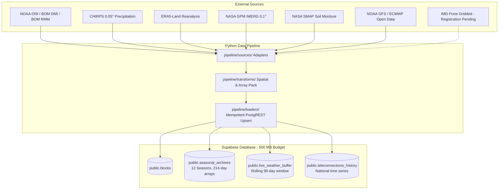

# BHUMI — Meteorological Data Ingestion Pipeline

**SIH 2026 Problem Statement 26086 | MoES / NCMRWF**  
Hyperlocal Monsoon Onset & Break Prediction System (Block/Village Scale)

---

## 1. Architecture Overview

BHUMI's data pipeline runs decoupled from the web application using **GitHub Actions on a public repository** for compute and **Supabase (PostgreSQL + PostGIS)** for storage, adhering strictly to the ₹0 recurring cost constraint.



---

## 2. Historical Archive Design: 12 Seasons (2014–2025)

### Storage Budget Resolution
TECH_STACK.md §3 recommends **12 seasons (2014–2025)** as the calibrated archive span:
- Full India (6,700 blocks) × 12 seasons × 1.8 KB = **~145 MB**
- Rolling 90-day live buffer = **~30 MB**
- Block geometry polygons = **~25 MB**
- Static terrain features & national indices = **~2 MB**
- Model weights = **~10 MB**
- **Total Storage = ~212 MB (leaving ~58% headroom under the 500 MB hard cap)**

*Note: Designing for 25 seasons would require ~300 MB for archives alone, leaving unsafe margins (<20%) for indexes, vacuuming, and temporary tables. The 12-season window captures the full diversity of ENSO/IOD phases (including the strong 2015–16 El Niño, 2019 positive IOD, 2020–22 triple La Niña, and 2023–24 El Niño).*

---

## 3. Data Sources & Ingestion Cadence

| Source | Parameters | Resolution | Update Cadence | Pipeline Cadence | Auth / Access |
| :--- | :--- | :--- | :--- | :--- | :--- |
| **NOAA ONI** | Oceanic Niño Index (ENSO) | National / Basin | Monthly | Daily & Weekly | Public URL (No key) |
| **BOM DMI** | Dipole Mode Index (IOD) | National / Basin | Monthly / Weekly | Daily & Weekly | Public URL (No key) |
| **BOM RMM** | Wheeler-Hendon MJO (Phase 1–8, Amplitude) | National / Daily | Daily | Daily & Weekly | Public URL (User-Agent required) |
| **CHIRPS** | Daily Precipitation | 0.05° (~5 km) | Daily (preliminary ~2d, final ~3w) | Weekly Historical Sync & Reconciliation | Public HTTP (No key) |
| **ERA5-Land** | 2m Temperature, Precipitation, Soil Water | 0.1° (~9 km) | Daily (ERA5T ~5d, final ~3m) | Weekly Historical Sync & Reconciliation | Copernicus CDS API Key |
| **NASA GPM IMERG** | Satellite Precipitation | 0.1° (~10 km) | Half-hourly / Daily | Daily Live Buffer & Weekly Sync | NASA Earthdata Login |
| **NASA SMAP** | Root-zone & Surface Soil Moisture | 9 km / 36 km | Daily (~2-3d lag) | Daily Live Buffer | NASA Earthdata Login |
| **NOAA GFS / GEFS** | NWP Forecast: Rain, Temp, Humidity | 0.25° (~25 km) | 6-hourly / Daily | Daily Live Buffer | Public NOMADS / AWS Open Data |
| **ECMWF Open Data** | Global Forecast: Rain, Temperature | 0.4° (~40 km) | 12-hourly | Daily Live Buffer | Public Open Data |
| **IMD Gridded** | Ground-truth Rain & Temperature | 0.25° / 1.0° | Historical / Periodic | Gracefully skipped (Registration pending) | IMD NDC Pune credentials |

---

## 4. Architectural Rules

1. **Array-Packed Historical Storage**: One row per block-season in `public.seasonal_archives`, containing 4 arrays of `smallint[214]` (1 April – 31 October). No one-row-per-day historical tables.
2. **Zero Permanent Panchayat Records**: Panchayat values are computed strictly on request via elevation/slope downscaling (BCSD lapse-rate) applied to the parent block.
3. **National Teleconnections**: Stored as a single national time series in `public.teleconnections_history`, never duplicated across 6,700 blocks.
4. **Rolling Buffer Retention**: Records older than 90 days are pruned from `public.live_weather_buffer`.
5. **Decoupled ML**: Step 3 does NOT execute ML inference. Inference is reserved for Step 4.

---

## 5. Local Setup & Execution

### Prerequisites
Python 3.10+ with pip.

```bash
# Install dependencies
pip install -r pipeline/requirements.txt
```

### Environment Configuration
Ensure `.env.local` contains:
```env
NEXT_PUBLIC_SUPABASE_URL=https://your-project.supabase.co
SUPABASE_SERVICE_ROLE_KEY=your-supabase-service-role-key

# Optional external keys
CDSAPI_URL=https://cds.climate.copernicus.eu/api
CDSAPI_KEY=your-cds-key
EARTHDATA_USERNAME=your-username
EARTHDATA_PASSWORD=your-password
```

### Running Tests
```bash
# Run unit and representative end-to-end pipeline tests
python -m unittest discover tests
```

### Running Jobs Locally

```bash
# Run Daily Live Sync in dry-run mode (safe simulation)
python -m pipeline.jobs.daily_sync --dry-run --days 7

# Run Weekly Historical Sync in dry-run mode
python -m pipeline.jobs.weekly_sync --dry-run --sample-only

# Run live sync against database
python -m pipeline.jobs.daily_sync --days 7
```

---

## 6. GitHub Actions Workflows

Two workflows are located under `.github/workflows/`:

1. **`weekly-historical-sync.yml`**:
   - Schedule: Sunday 20:00 UTC (Monday 01:30 AM IST).
   - Ingests finalized teleconnections and historical updates (2014–2025).
   - Executes monthly reconciliation swapping preliminary values for finalized observations.
2. **`daily-live-sync.yml`**:
   - Schedule: Daily at 00:30 UTC (06:00 AM IST).
   - Updates latest ENSO/IOD/MJO indices.
   - Refreshes 90-day live weather buffer.
   - Prunes records older than 90 days.
   - Keeps Supabase project active (preventing 7-day auto-pause).
